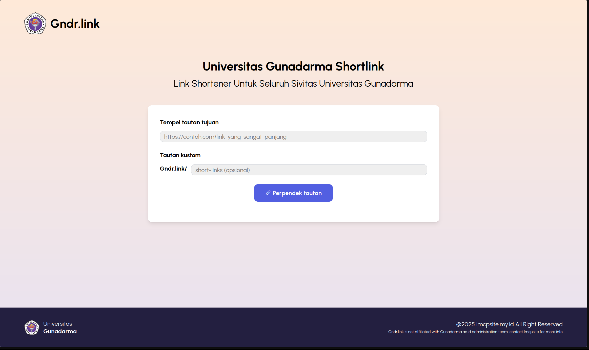
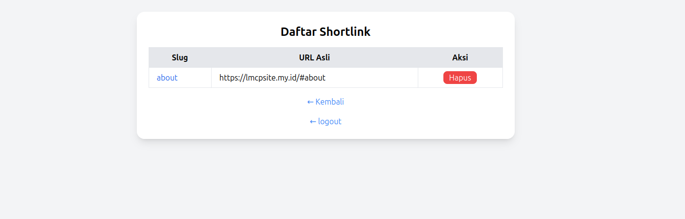

# Gunadarma Shortlink - Shortlink Website dari mahasiswa untuk semua

    

## Awalan

Project ini terpikirkan karena banyaknya penggunaan link dan di share ke seluruh mahasiswa entah itu untuk pembelajaran, kegiatan UKM, kegiatan BEM, dan lain lain. Namun melihat link yang dishare kadang memiliki slug yang terlalu panjang sehingga sulit untuk share link tanpa mengharuskan copy - paste terlebih dahulu. oleh karena itu, dibuatlah shortlinks yang saya dedikasikan untuk universitasku, Universitas Gunadarma agar digunakan untuk kepentingan semua itu.

## Fitur Utama

* Membuat link yang ingin dishare menjadi lebih singkat, bahkan bisa dikustomisasi
* Admin page untuk melihat seluruh link dan tujuan
* (upcoming) Hit Gunadarma Website untuk menyediakan loginpage khusus mahasiswa Gunadarma dan mengatur list shortener link masing-masing

## Preview Aplikasi





## Instalasi

**1. Clone Repositories**

```bash
git clone https://github.com/LuthfiMC269/UGlink.git
cd UGlink
```

**2. Setup Depedencies**

Buat venv masing-masing sesuai OS

```bash
pip install -r requirements.txt
npm install
npm run build
```

**3. Jalankan Aplikasi**

Disarankan menggunakan gunicorn untuk production, flask untuk development

```bash
gunicorn -w 4 -b 0.0.0.0:8000 app:app
```

## 🤝 Kontribusi

Kontribusi selalu diterima! Berikut cara berkontribusi:

1. **Fork** repository ini
2. **Create** feature branch (`git checkout -b feature/AmazingFeature`)
3. **Commit** perubahan (`git commit -m 'Add some AmazingFeature'`)
4. **Push** ke branch (`git push origin feature/AmazingFeature`)
5. **Open** Pull Request

### Guidelines Kontribusi

* Ikuti code style yang sudah ada
* Tambahkan tests untuk fitur baru
* Update dokumentasi jika diperlukan
* Pastikan semua tests passing

## 📞 Kontak & Support

* 📧 **Email**: [luthfimc269@pm.me](mailto:luthfimc269@pm.me)
